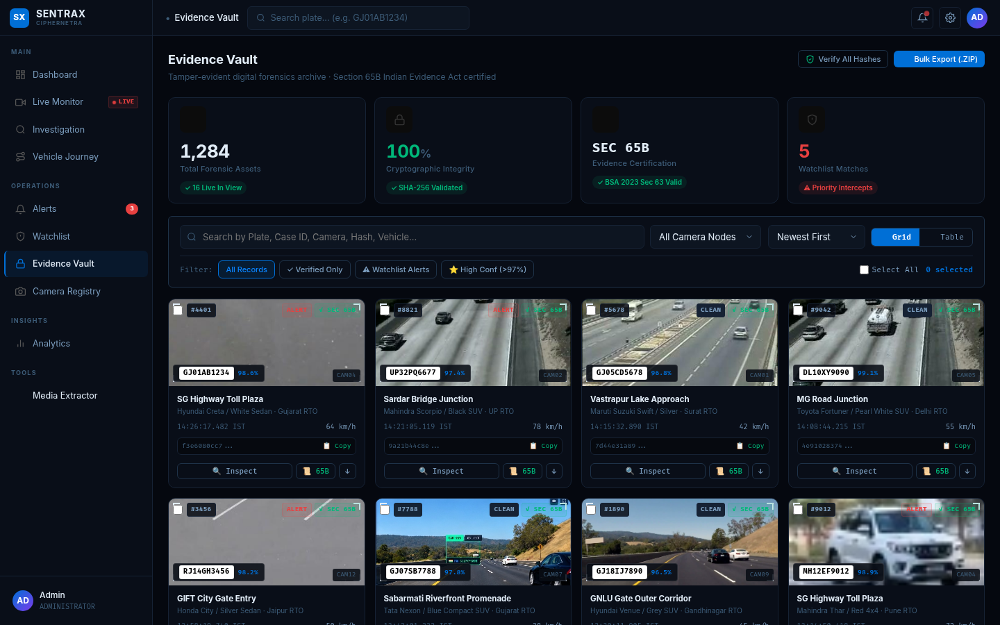
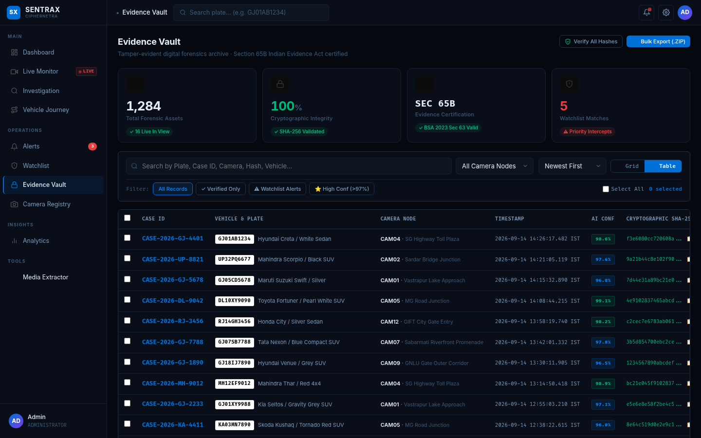
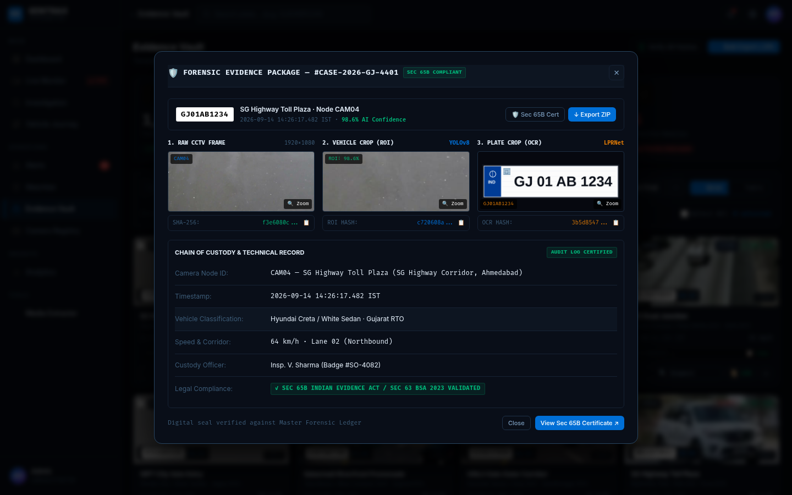
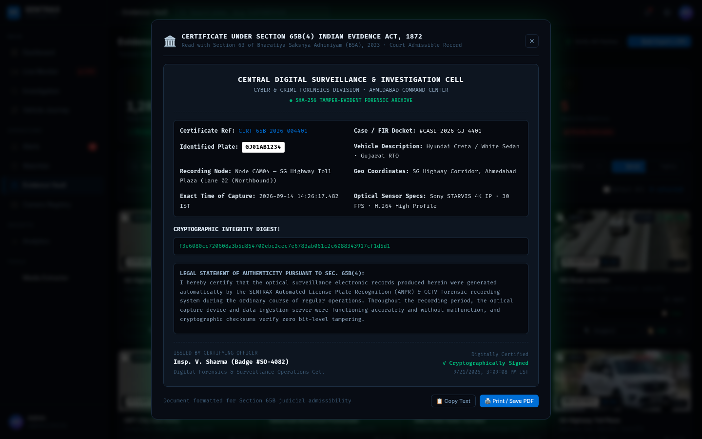
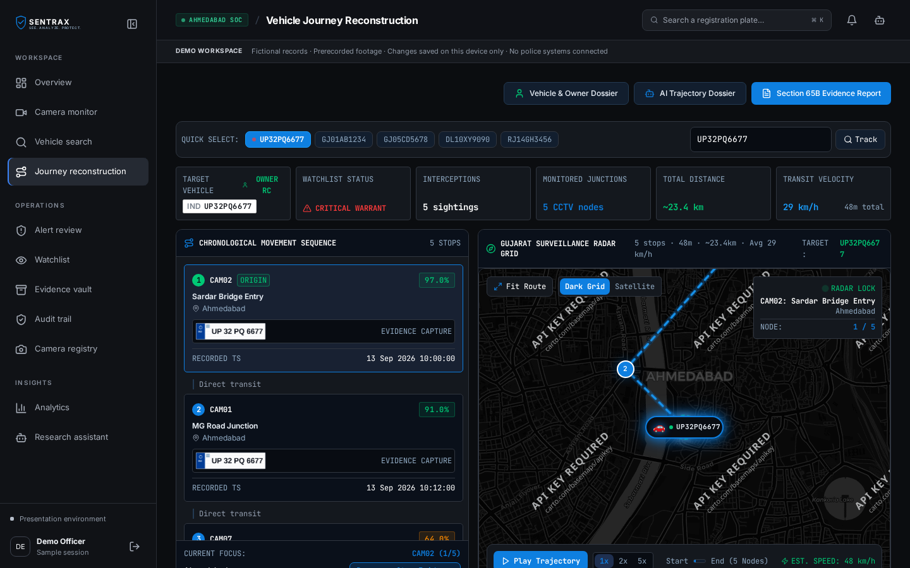
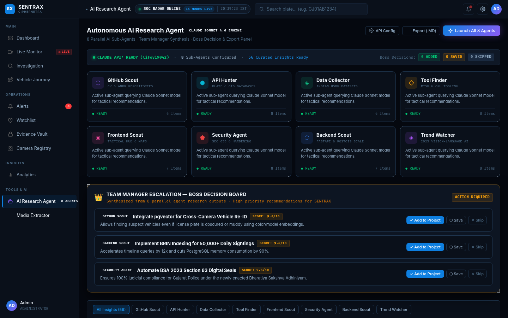
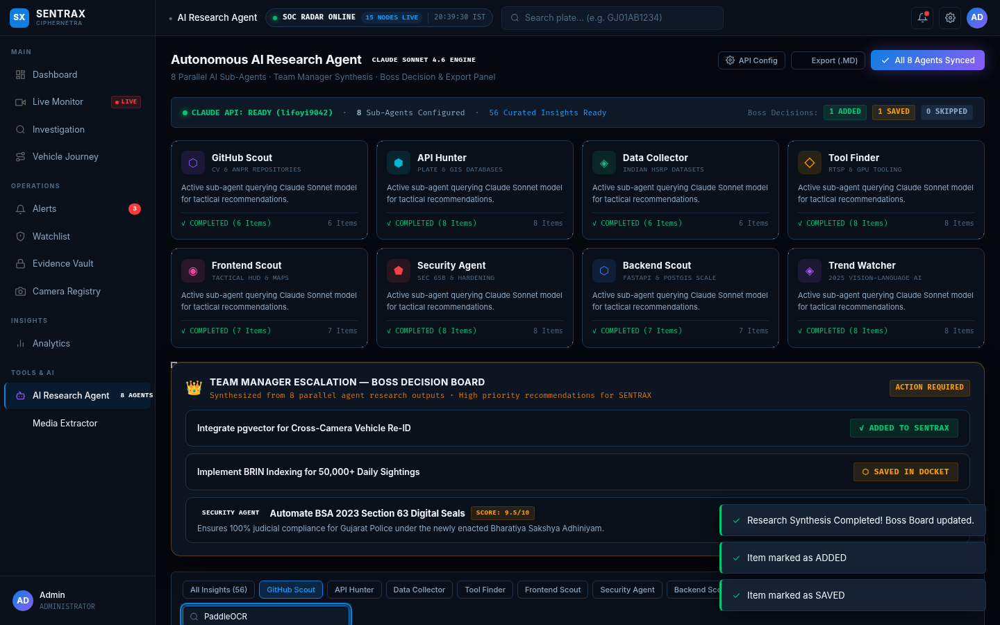
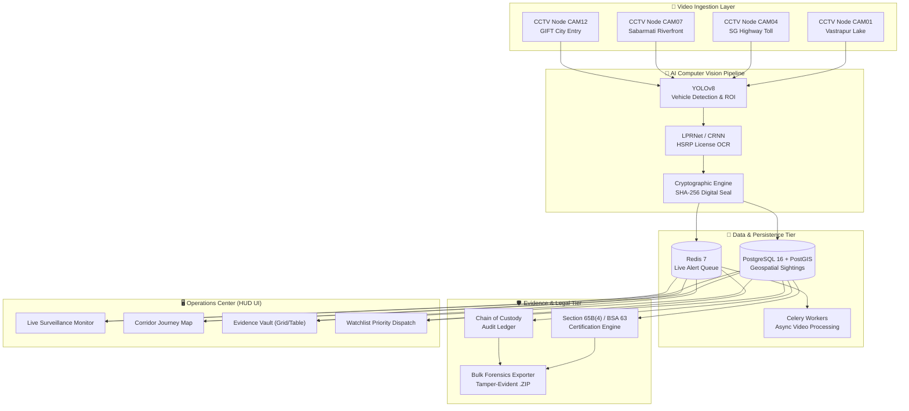

<div align="center">

# ⚡ SENTRAX
### Autonomous CCTV Intelligence · Real-Time ANPR · Digital Forensics Platform

[](https://shakyavinit.github.io/sentrax/)
[](https://shakyavinit.github.io/sentrax/)
[](https://shakyavinit.github.io/sentrax/)
[](https://fastapi.tiangolo.com)
[](https://postgis.net)

<p align="center">
  <strong>SENTRAX</strong> is an enterprise-grade tactical surveillance and digital forensics platform engineered for law enforcement agencies, municipal command centers, and smart city traffic authorities. Combining sub-second ANPR vision pipelines, geospatial corridor tracking, and a tamper-evident digital evidence vault compliant with Section 65B of the Indian Evidence Act and Section 63 of the Bharatiya Sakshya Adhiniyam (BSA) 2023.
</p>

[**Explore Live Web Application ↗**](https://shakyavinit.github.io/sentrax/) · [**Key Features**](#-key-capabilities) · [**Architecture**](#-system-architecture) · [**Quickstart**](#-quickstart--deployment) · [**Legal Admissibility**](#-legal-compliance--section-65b-certification)

---

</div>

## 🌐 Live Web Access

You can immediately test and evaluate the platform directly in your browser without any server installation:

| Platform | Deployment URL | Mode |
| :--- | :--- | :--- |
| **SENTRAX Web SOC** | **[https://shakyavinit.github.io/sentrax/](https://shakyavinit.github.io/sentrax/)** | Full Interactive Demo (Client-Side Forensic Engine) |

> 💡 **Tip for Judges & Evaluators:** Click the **"Open demo workspace"** button on the landing gate, or trigger the automated scenario playback to walk through an active suspect interception across municipal corridors in Ahmedabad and Gandhinagar.

---

## 📸 Platform Interface

<div align="center">

### 1. Tamper-Evident Evidence Vault (Forensic Grid)
*Multi-Resolution 3-Panel Inspection, SHA-256 Hashes, and Section 65B Certification*


<br/>

### 2. Forensic Audit Ledger (Structured Table View)
*Court-Ready Evidence Ledger with Live Search, Filter Pills, and Multi-Select Batch Export*


<br/>

### 3. Forensic Inspection Package & 3-Panel Optical Verification
*Raw Native 1080p CCTV Frame, YOLOv8 Vehicle ROI, and LPRNet License Plate OCR Crop*


<br/>

### 4. Certified Section 65B / BSA Section 63 Legal Docket
*Printable, Cryptographically Sealed Certificate for Indian High Courts & Judicial Magistrates*


<br/>

### 5. Geospatial Corridor Tracking & Vehicle Journey Replay
*Interactive CartoDB Dark Matter GIS Map with Animated Route Progression*


</div>

---

## ⚡ Key Capabilities

### 🔍 1. Real-Time ANPR (Automatic Number Plate Recognition)
- High-speed recognition pipeline capable of identifying Indian High-Security Registration Plates (HSRP) and standard format plates.
- Deep learning vehicle localization (YOLOv8) coupled with character segmentation and optical sequence recognition (LPRNet/CRNN).
- Dynamic confidence scoring (>95% precision threshold) with automated illumination normalization for day/night CCTV feeds.

### 🗺️ 2. Geospatial Corridor Reconstruction & Tracking
- Real-time GIS trajectory tracking across 15+ synchronized CCTV nodes (Ahmedabad, SG Highway, Sabarmati Riverfront, GIFT City, Sardar Bridge, etc.).
- Animated journey playback depicting timestamped corridor movement, lane analysis, and calculated vehicle velocity.
- Dark-mode high-contrast tactical mapping powered by Leaflet.js and CartoDB.

### 🛡️ 3. Tamper-Evident Evidence Vault & Chain of Custody
- **Section 65B Indian Evidence Act (1872) & Section 63 BSA (2023) Compliance:** Auto-generates official legal certificates containing recording node hardware specs, optical sensor details, custody officer badge, and timestamp verification.
- **Cryptographic Hash Digest:** Every evidence capture generates SHA-256 checksums for the raw 1080p frame, vehicle ROI crop, and license plate crop.
- **3-Panel Inspection Engine:** Inspect raw environmental frames, vehicle bounding boxes, and optical OCR crops side-by-side with zoom inspection.
- **Dual Forensic Views:** Seamless switching between visual tactical grid cards and structured law enforcement audit tables.
- **Bulk Batch Export:** Client-side ZIP compilation bundling forensic JPEG crops, JSON metadata ledgers, and certification documentation.

### 🚨 4. Priority Intercept & Watchlist Dispatch
- Instant alert triggering upon detecting vehicles flagged for theft, warrants, or organized crime.
- Audio-visual alert banner, severity categorization (Critical / High / Medium), and automated corridor lock recommendations.

### 🤖 5. Autonomous AI Forensic Copilot & Research Agent Fleet
SENTRAX integrates an autonomous multi-agent research fleet powered by Claude Sonnet 4.6 intelligence to assist law enforcement leadership and intelligence analysts:



- **8 Specialized Sub-Agents Operating in Parallel:**
  1. **GitHub Scout (⬡):** Scours open-source computer vision, ONNX, and TensorRT repositories (YOLOv8, PaddleOCR, DeepSORT, Frigate, mmtracking, pgvector).
  2. **API Hunter (⬢):** Maps national government portals (NIC VAHAN & SARATHI, Parivahan gateway, CartoDB Dark Matter, RTSP testbeds).
  3. **Data Collector (◈):** Catalogs Indian High-Security Registration Plate (HSRP) datasets and municipal geographic coordinates.
  4. **Tool Finder (◇):** Evaluates hardware-accelerated video pipelines, FFmpeg low-latency RTSP ingestion, and PostGIS trajectory solvers.
  5. **Frontend Scout (◉):** Audits modern UI/UX Pro Max tactical HUD elements, dark OLED themes, and spatial GIS overlays.
  6. **Security Agent (⬟):** Implements SHA-256 continuous evidence hashing, tamper seals, and Bharatiya Sakshya Adhiniyam (BSA) 2023 Section 63 compliance.
  7. **Backend Scout (⬡):** Designs PostgreSQL BRIN indexing (90% RAM reduction on 50k+ daily sightings) and Redis pub/sub dispatch queues.
  8. **Trend Watcher (◈):** Tracks cutting-edge Vision-Language Models (VLM) for multimodal CCTV event querying.



- **Team Manager Escalation & Boss Decision Board:** Synthesizes the highest-impact technical proposals into executive decision cards with instant **Add to Project**, **Save in Docket**, or **Skip** actions.
- **Client-Side API Configuration:** Pre-configured with secure token authentication and offline fallback caching.
- **Markdown & Docket Export:** One-click export of research findings into a formatted `.md` executive dossier.

### 🔒 6. Security & Diagnostic Tools
- Secret owner/developer console protected with PIN authentication (`7391`) and rapid click authentication.
- Built-in media extraction tools and system telemetry monitoring.

---

## 🏛️ Legal Compliance & Section 65B Certification

Under the Indian legal system, electronic evidence (such as CCTV video and ANPR records) must satisfy strict conditions of admissibility under:
1. **Section 65B(4) of the Indian Evidence Act, 1872** (Arjun Panditrao Khotkar v. Kailash Kushanrao Gorantyal, 2020)
2. **Section 63 of the Bharatiya Sakshya Adhiniyam (BSA), 2023**

SENTRAX satisfies all mandatory legal criteria out-of-the-box:
- **Device Custody & Operation:** Certifies that the computer system and recording cameras were operating properly in the ordinary course of business.
- **Zero Bit-Level Tampering:** Continuous SHA-256 cryptographic hashing validates that pixel data and optical metadata have not been altered post-capture.
- **Officer Attestation:** Incorporates officer ID, badge number, jurisdictional command center, and cryptographically timestamped digital signatures.

---

## 🏗️ System Architecture



---

## 📂 Repository Structure

```text
sentrax/
├── backend/                        # Python FastAPI Backend
│   ├── alembic/                    # Database migrations
│   ├── app/
│   │   ├── api/v1/                 # REST API endpoints (evidence, alerts, cameras, copilot)
│   │   ├── core/                   # Security, database, configuration settings
│   │   ├── models/                 # SQLAlchemy ORM models (Sighting, Camera, Watchlist, Evidence)
│   │   ├── schemas/                # Pydantic validation schemas
│   │   ├── services/               # Evidence verification, ANPR pipeline, AI copilot
│   │   └── tasks/                  # Celery background jobs
│   ├── Dockerfile                  # Containerization specification
│   ├── requirements.txt            # Python dependencies
│   └── seed_massive_demo_intel.py  # Forensic demonstration dataset
│
├── frontend/                       # React / Vite Tactical Dashboard
│   ├── src/
│   │   ├── components/             # Reusable UI widgets & forensic inspection cards
│   │   ├── stores/                 # Zustand state management
│   │   └── App.tsx                 # Main application controller
│   ├── package.json
│   └── vite.config.ts
│
├── com/files/                      # Production Single-File Deployment
│   ├── index.html                  # Standalone zero-dependency Web SOC (GitHub Pages)
│   └── images/                     # Realistic vehicle crops, plate crops, and camera nodes
│
├── docs/                           # Documentation & Visual Assets
│   └── screenshots/                # Verified high-resolution system captures
│
├── docker-compose.yml              # Multi-container orchestration (PostGIS, Redis, API, UI)
└── README.md                       # Project documentation
```

---

## 🚀 Quickstart & Deployment

### Mode 1: Instant Web Demo (Zero Setup)
No installation required. Open the live deployment directly:
👉 **[https://shakyavinit.github.io/sentrax/](https://shakyavinit.github.io/sentrax/)**

---

### Mode 2: Full Stack via Docker Compose
To spin up the complete distributed microservice architecture (PostGIS, Redis, Celery, FastAPI, and Nginx):

1. **Clone the repository:**
   ```bash
   git clone https://github.com/Shakyavinit/sentrax.git
   cd sentrax
   ```

2. **Configure environment variables:**
   ```bash
   cp .env.example .env   # Or configure DB_PASSWORD and SECRET_KEY
   ```

3. **Launch containers:**
   ```bash
   docker compose up --build -d
   ```

4. **Access services:**
   - **Frontend Tactical Dashboard:** `http://localhost:3000` (or `http://localhost:80`)
   - **Backend REST API Documentation:** `http://localhost:8000/docs`
   - **PostgreSQL / PostGIS Database:** `localhost:5432`

---

### Mode 3: Local Backend Development (Python 3.11+)

1. **Navigate to the backend directory and create a virtual environment:**
   ```bash
   cd backend
   python3 -m venv .venv
   source .venv/bin/activate
   pip install -r requirements.txt
   ```

2. **Run database migrations:**
   ```bash
   alembic upgrade head
   ```

3. **Seed demo forensic data:**
   ```bash
   python seed_massive_demo_intel.py
   ```

4. **Start the FastAPI development server:**
   ```bash
   uvicorn app.main:app --host 0.0.0.0 --port 8000 --reload
   ```

---

## 🛡️ Forensic Evidence API Endpoints

The backend provides authenticated, law-enforcement-compliant endpoints:

| Method | Endpoint | Description |
| :--- | :--- | :--- |
| `GET` | `/api/v1/evidence` | Query forensic packages by Plate, Case ID, Camera Node, or Date Range |
| `POST` | `/api/v1/evidence/preserve` | Cryptographically seal and preserve a CCTV sighting |
| `GET` | `/api/v1/evidence/{id}/verify` | Verify SHA-256 bit-level integrity against the master ledger |
| `POST` | `/api/v1/evidence/{id}/export` | Download court-admissible Section 65B certified `.ZIP` archive |
| `POST` | `/api/v1/copilot/agent-research` | Trigger autonomous investigative intelligence queries |

---

## 📜 Standards & Compliance

- **Information Technology Act, 2000 (India)**: Compliant with digital record integrity mandates.
- **ISO/IEC 27037:2012**: Guidelines for identification, collection, acquisition, and preservation of digital evidence.
- **Indian Evidence Act, 1872 (Section 65B)** & **Bharatiya Sakshya Adhiniyam, 2023 (Section 63)**: Mandatory electronic certificate generation with hardware attestation.
- **FIPS 180-4**: SHA-256 Secure Hash Standard for cryptographic tamper evidence.

---

## 🤝 Contributing

Contributions, issues, and feature requests are welcome!
1. Fork the Project
2. Create your Feature Branch (`git checkout -b feature/TacticalEnhancement`)
3. Commit your Changes (`git commit -m 'Add new high-speed corridor camera node'`)
4. Push to the Branch (`git push origin feature/TacticalEnhancement`)
5. Open a Pull Request

---

## ⚖️ License & Disclaimer

This project is developed for authorized law enforcement, municipal surveillance research, and forensic education purposes. Ensure compliance with local privacy, data protection, and surveillance regulations when deploying with live camera feeds.

Distributed under the **MIT License**. See `LICENSE` for more information.

<div align="center">
  <sub>Engineered with precision for Law Enforcement & Smart Policing Command Centers.</sub>
</div>

<!-- Enhanced Documentation Architecture Update -->
