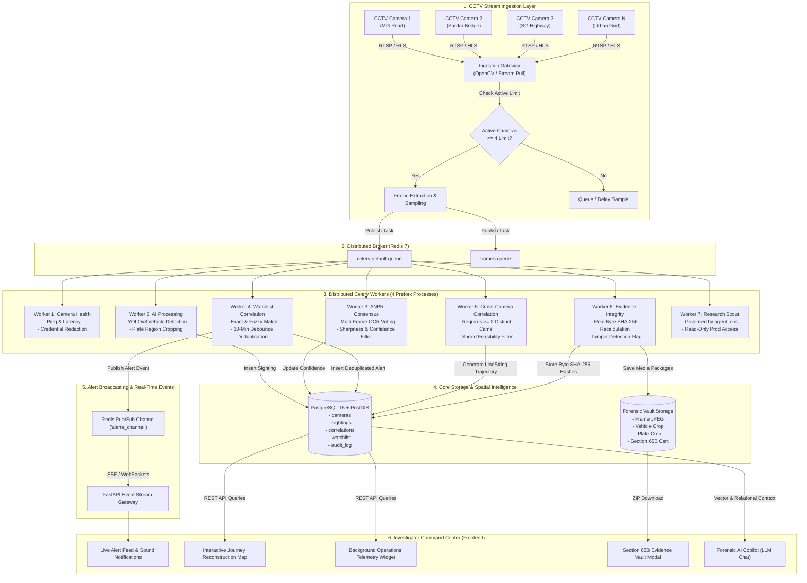
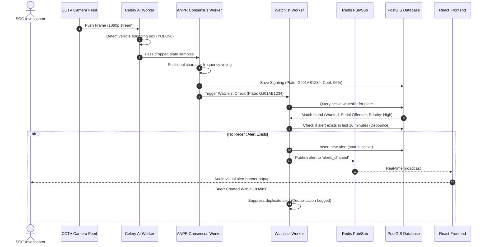
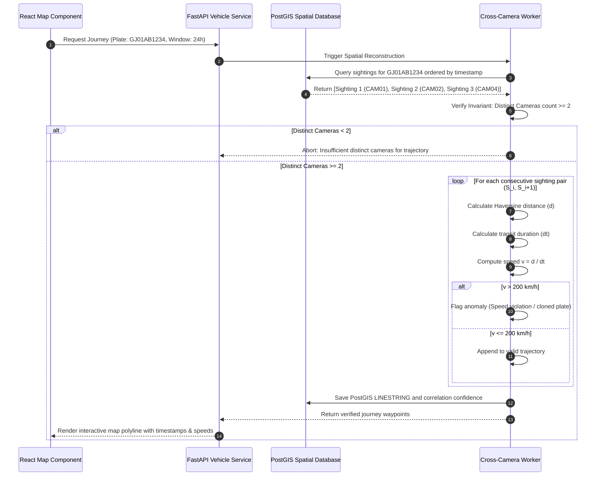
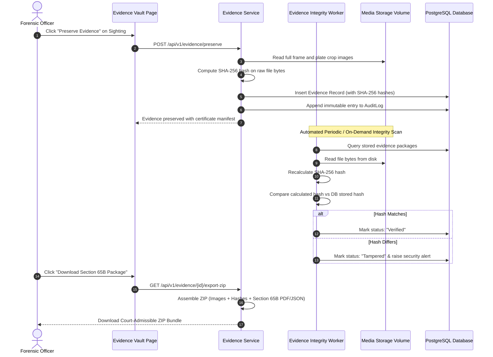

# SENTRAX — End-to-End System Workflow
**System**: SENTRAX (AI-Powered CCTV Intelligence & Digital Forensics Platform)  
**Team**: CipherNetra  
**Hackathon**: Gujarat Sentinel Hackathon / SIH  
**Version**: 1.0.0  

---

## 1. End-to-End Operational Flowchart

---

## 2. Detailed Subsystem Sequence Workflows

### 2.1 Multi-Frame ANPR Consensus & Watchlist Alert Sequence

### 2.2 Cross-Camera Journey & Speed Feasibility Verification

### 2.3 Forensic Evidence Capture & Section 65B Audit Trail

